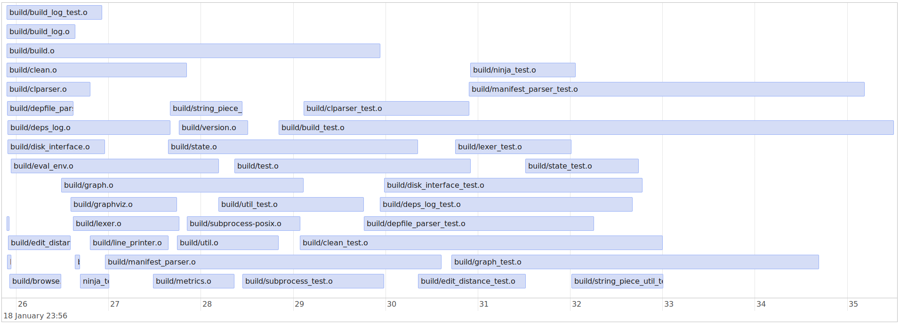

# ninjavis #
[](https://travis-ci.org/chagui/ninjavis)
[](https://badge.fury.io/py/ninjavis)

## Introduction ##
Generate visualization from [Ninja](https://github.com/ninja-build/ninja) build logs. Ninjavis parse the ninja build
logs and for each item of the build extract its target, starting and end time.
It output those information in a template containing a simple timeline ; the visualization is done by [vis.js](http://visjs.org/).

Inspired by [buildbloat](https://github.com/nico/buildbloat).

## Usage ##
```bash
usage: ninjavis --title "my build" ninja_build.log build_profile.html
```
:warning: Run ``ninja -t recompact`` first ot make sure that no duplicate entries are in the build log.

## Example ##
Profile of Ninja 1.8.2 build

